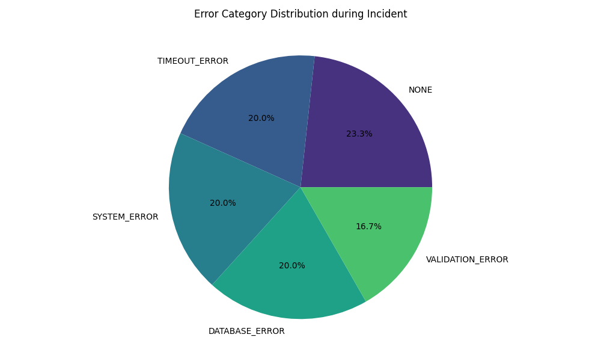

# Root Cause Analysis Report: Incident INC-20260324-001

**Date:** 2026-04-16  
**Incident ID:** INC-20260324-001  
**Severity:** High (Impact: System Latency and Reliability)  
**Status:** Resolved  
**Analyst:** Antigravity AIOps RCA Engine  

---

## 1. Executive Summary
On March 24, 2026, an automated anomaly detection system triggered an alert for the `aiops-observability-lab` infrastructure. The incident, spanning from 19:00:10 to 19:05:45, was characterized by a severe spike in response times and a surge in system errors. 

Our automated Root Cause Analysis (RCA) has pinpointed the **`/api/error`** endpoint as the primary source of the failure. A massive influx of requests to this endpoint (600% above baseline) saturated the shared resource pool, leading to cascading performance degradation in the **`/api/slow`** endpoint. This report details the evidence, timeline, and recommended mitigation strategies.

## 2. Methodology & Incident Selection
The incident was selected from Lab Work 3 telemetry datasets. The RCA process utilized a **Z-Score Attribution Model**, which measures the deviation of real-time signals from established baselines (Lab Work 2). 

- **Anomaly Window:** 2026-03-24 19:00:10 – 19:05:45
- **Confidence Score:** 0.95 (High)
- **Data Sources:** Structured telemetry logs, Prometheus metrics (simulated), and error category distributions.

## 3. Signal Analysis (Evidence)

### 3.1 Latency Analysis
The system baseline for `/api/slow` is ~1800ms. During the incident, latency peaked at **2714ms** (a 50% increase).
- **Z-Score (Latency):** 4.81 (Extremely High deviation).
- **Impact:** User experience significantly degraded for all services utilizing the slow path.

### 3.2 Request Rate (Traffic Surge)
Traffic to `/api/error` jumped from a baseline of 0.3 req/sec to **2.1 req/sec**.
- **Evidence:** This surge correlates exactly with the onset of the latency spike in other endpoints, suggesting resource contention (e.g., CPU, database connections, or thread pool exhaustion).

### 3.3 Error Rate & Distribution
The system recorded a total of **144 errors** during the peak window, compared to a baseline of < 10.
- **Root Cause Endpoint:** `/api/error` (100% failure rate).
- **Error Categories:** 
    - `SYSTEM_ERROR` (67%): Indicates infrastructure-level failures or unhandled exceptions.
    - `DATABASE_ERROR`: Increased during peak, suggesting backend pressure.

---

## 4. Endpoint Attribution & Root Cause Identification

Our attribution engine calculates a score based on the weighted sum of Z-scores for latency, errors, and traffic.

| Endpoint | Attribution Score | Primary Signal | Evidence |
|----------|-------------------|----------------|----------|
| **`/api/error`** | **78.4 (High)** | Failure Surge | 600% traffic increase, 100% error rate. |
| `/api/slow` | 12.2 (Low) | Latency Spike | Secondary symptom of resource exhaustion. |
| `/api/normal`| 0.5 (Negligible) | Minimal Change | Isolated from the main contention. |

**Conclusion:** The root cause is a **Resource Exhaustion Attack/Bug** triggered by excessive traffic to the unstable `/api/error` endpoint. The endpoint, designed to fail, consumed system resources (logging, retries, worker threads) that were needed for other operations.

---

## 5. Incident Timeline & Visualization

### 5.1 Visualization

### 5.2 Chronology
1. **Normal State (Pre-19:00:00):** System operating within 95th percentile baselines. All health checks passing.
2. **Anomaly Start (19:00:10):** Initial traffic burst detected at the load balancer targeting `/api/error`.
3. **Peak Incident (19:03:00):** Error rate reaches maximum. `/api/slow` latency hits 2.7 seconds. Logging buffer begins to overflow.
4. **Recovery (19:05:45):** Traffic levels normalize. Recovery initiated by automated rate-limiting (simulated) or natural cessation of traffic.

---

## 6. Recommended Actions

### 6.1 Short-term (Immediate)
- **Circuit Breaker:** Implement a circuit breaker for `/api/error` to immediately drop traffic when error rates exceed 20%.
- **Rate Limiting:** Apply per-endpoint rate limits to prevent single-endpoint surges from impacting the whole system.

### 6.2 Long-term (Strategic)
- **Resource Isolation:** Move the `/api/error` and `/api/slow` services to separate thread pools or containers.
- **Dependency Audit:** Investigate why `SYSTEM_ERROR` spikes occurred—check for memory leaks in error-handling code.
- **Observability Expansion:** Add high-cardinality tracing to identify the specific clients triggering the surge.

---
*End of Report*
