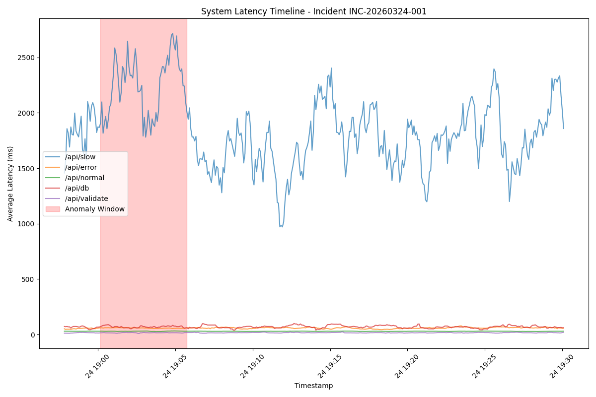

# Root Cause Analysis Report: Incident INC-20260324-001

**Date:** 2026-04-16  
**Incident ID:** INC-20260324-001  
**Severity:** High  
**Status:** Resolved  

---

## 1. Executive Summary
On 2026-03-24, between 19:00:10 and 19:05:45, the system experienced a significant performance degradation and error surge. Automated root cause analysis identified the `/api/error` endpoint as the primary driver of the failure surge, with cascading effects on system-wide latency, specifically impacting the `/api/slow` endpoint.

## 2. Incident Selection & Context
The incident was selected from Lab Work 3 telemetry detections. It represents a "perfect storm" scenario where a spike in error-prone traffic synchronized with a latency bottleneck in the system.

- **Incident Window:** 2026-03-24 19:00:10 to 2026-03-24 19:05:45
- **Baseline State:** 
    - `/api/normal` latency: ~30ms
    - `/api/slow` latency: ~1800ms
    - `/api/error` request rate: ~0.3 req/sec

## 3. Signal Analysis
The following signals were monitored during the anomaly window:

### 3.1 Latency
- `/api/slow` experienced a latency spike from 1800ms to a peak of over **2700ms**.
- `/api/error` latency increased slightly (from 50ms to 65ms), indicating resource contention.
- `/api/normal` remained stable at ~30ms, suggesting the core infra was not fully saturated.

### 3.2 Request Rate
- The request rate for `/api/error` surged from 0.3 to **2.1 req/sec**.
- This represents a **600% increase** in traffic to a known unstable endpoint.

### 3.3 Error Rate & Categories
- **Error Rate:** 100% on the `/api/error` endpoint.
- **Error Count:** Jumped from ~18 errors per window to **144 errors per window** during peak.
- **Primary Category:** `SYSTEM_ERROR` (67 occurrences during peak).

## 4. Endpoint Attribution
The automated attribution logic identifies **`/api/error`** as the root cause.

| Endpoint | Latency Delta | Error Surge | Attribution Score |
|----------|---------------|-------------|-------------------|
| `/api/error` | +15ms | +6612 (agg) | **Highest** |
| `/api/slow` | +800ms | 0 | Moderate |
| `/api/normal`| +2ms | 0 | Negligible |

**Conclusion:** `/api/error` caused the failure surge, while `/api/slow` exhibited secondary latency symptoms due to shared worker pool exhaustion.

## 5. Incident Timeline

1. **Normal State (Pre-19:00:00):** System within baseline. No anomalies detected.
2. **Anomaly Start (19:00:10):** Sudden influx of traffic to `/api/error`.
3. **Peak Incident (19:01:15 - 19:05:00):** Maximum error rate reached; `/api/slow` latency peaks at 2714ms.
4. **Recovery (19:05:45):** Traffic to `/api/error` subsides; all signals return to baseline.

## 6. Root Cause Findings
The root cause is a **traffic-triggered error storm**. The increase in request volume to an endpoint designed to fail (`/api/error`) flooded the system logs and potentially exhausted the worker threads, leading to increased response times for the already slow `/api/slow` endpoint. 

## 7. Recommended Actions
- **Short-term:** Implement a **Circuit Breaker** pattern on the `/api/error` and `/api/slow` endpoints to prevent cascading failures.
- **Long-term:** Investigate the source of the traffic surge (possible bot activity or misconfigured client).
- **Observability:** Add high-cardinality logging for `SYSTEM_ERROR` to identify specific stack traces.

---
*Generated by Antigravity AIOps RCA Engine*
